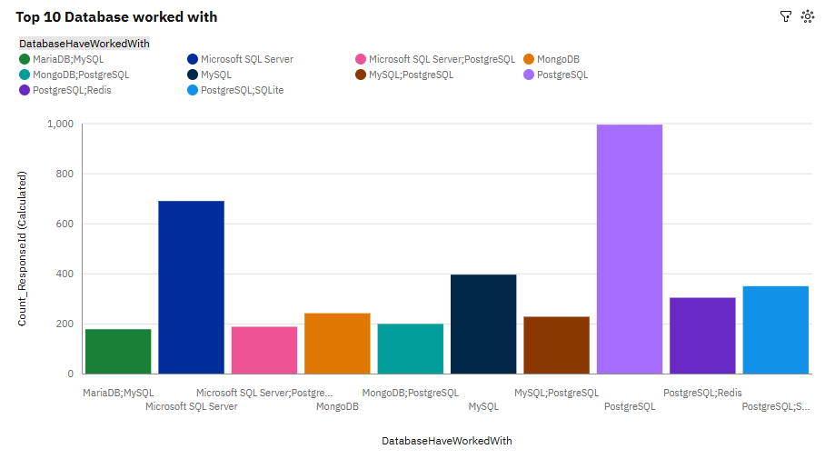
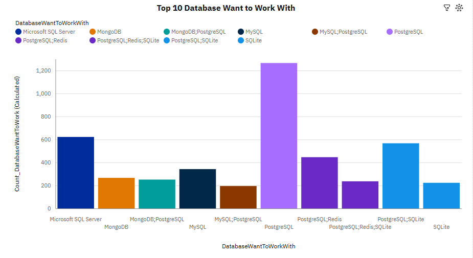

# 📊 Global Developer Trends Analysis  

## 🔍 Overview  
This project presents an end-to-end analysis of global developer trends using survey data. It explores **technology adoption, compensation patterns, job satisfaction, and future skill preferences**, with insights delivered through Python-based analysis and an interactive **IBM Cognos Analytics dashboard**.

---

## 🎯 Objectives  
- Analyze current vs future technology trends  
- Understand developer demographics and education distribution  
- Explore relationships between compensation, experience, and satisfaction  
- Identify industry shifts in tools, platforms, and frameworks  

---

## 🛠️ Tools & Technologies  
- Python (pandas, matplotlib)  
- SQLite (data handling)  
- IBM Cognos Analytics (dashboard & visualization)  
- Data Cleaning & Transformation Techniques  

---

## 🧹 Data Preparation  
- Converted categorical fields (e.g., Age → numeric groups)  
- Handled missing and inconsistent values  
- Split multi-value columns (languages, databases, platforms)  
- Standardized dataset for accurate aggregation  

---

## 📊 Dashboard Overview  

The dashboard presents **comparative insights between current usage and future preferences** across key technology areas.

---

### 🗄️ Databases: Current vs Future Preferences  

| Current Databases | Desired Databases |
|------------------|------------------|
|  |  |

---

### ☁️ Platforms: Current vs Future Preferences  

| Current Platforms | Desired Platforms |
|------------------|------------------|
|  |  |

---

### 💻 Programming Languages: Current vs Future  

| Current Languages | Desired Languages |
|------------------|------------------|
|  |  |

---

### 🌐 Web Frameworks: Current vs Future  

| Current Frameworks | Desired Frameworks |
|-------------------|-------------------|
|  |  |

---

### 👥 Demographics Insight  

| Respondent Distribution |
|------------------------|
|  |

---

## 🔑 Key Findings  

### 1. Dominance of Modern Technologies  
- PostgreSQL, JavaScript/TypeScript, and AWS dominate both current and future usage  
- Indicates strong industry standardization around modern stacks  

---

### 2. Rising Demand for Data & AI Technologies  
- Python shows significant growth in future preference  
- Reflects shift toward:
  - Data science  
  - Machine learning  
  - Automation  

---

### 3. Cloud Adoption is Strong and Growing  
- AWS and Microsoft Azure lead platform usage  
- Increasing interest in multi-cloud environments  

---

### 4. Transition from Traditional to Modern Tools  
- Technologies like SQL Server and PHP remain widely used  
- But are less preferred for future learning  

---

### 5. Growth of Polyglot Development  
- Developers increasingly use multiple tools and technologies together  
- Reflects real-world system complexity and specialization  

---

### 6. Developer Demographics Insight  
- Majority of respondents fall within 25–34 age group  
- Most hold Bachelor’s or Master’s degrees  

---

## 📌 Conclusion  

The analysis highlights a clear shift toward modern, scalable, and data-driven technologies. Developers are actively transitioning toward tools that support cloud computing, data analytics, and full-stack development. This trend underscores the importance of continuous learning and adaptability in today’s rapidly evolving tech landscape.

---

## 🚀 Future Improvements  
- Build predictive models (e.g., salary prediction)  
- Deploy dashboard using Power BI or Tableau  
- Automate data pipelines for real-time insights  

---

## 💼 Portfolio Impact  

This project demonstrates:  
- End-to-end data analysis workflow  
- Strong data cleaning and transformation skills  
- Advanced visualization techniques  
- Dashboard development  
- Insight-driven storytelling  

---

## 📎 Author  
**Bulus Umoru**  
📍 Potsdam, Germany  
🔗 LinkedIn: https://www.linkedin.com/in/bulus-umoru/  

---

## 📂 Project Structure  

# 📊 Global Developer Trends Analysis
### 🔍 Overview

This project explores global developer trends using survey data, focusing on compensation, experience, job satisfaction, and technology preferences. The goal is to uncover actionable insights that reflect current industry patterns and future skill demand.

---
### 🎯 Objectives
- Analyze developer demographics and experience levels
- Explore compensation trends across age and experience
- Identify popular and emerging technologies
- Examine relationships between job satisfaction and key factors
---
### 🛠️ Tools & Technologies
- Python (pandas, matplotlib)
- SQLite (data storage & querying)
- IBM Cognos Analytics (dashboarding)
- Data Visualization Techniques
---  

### 📊 Dashboard
 An interactive dashboard was built using IBM Cognos Analytics to visualize:
  - Top programming languages and databases
  - Respondent demographics
  - Compensation and job satisfaction trends

<table>
  <tr>
    <td align="center">
       <b>Monthly Revenue Trend</b>  
      
    </td>
    <td align="center">
     <b>Revenue by Country</b> 
     
    </td>
  </tr>
  <tr>
    <td align="center">
      <b>Customer Segments</b> 
      
    </td>
    <td align="center">
     <b>Customer Clusters</b>  
      
    </td>
  </tr>
</table>
---
    
### 🔑 Key Insights
- Strong dominance of modern technologies: JavaScript, TypeScript, PostgreSQL
- Rising demand for Python, driven by data and AI applications
- Traditional tools remain widely used but are less desired for future work
- Developers are increasingly adopting multi-technology (polyglot) stacks
--- 
### 📌 Conclusion
The analysis highlights a clear industry shift toward modern, scalable, and data-driven technologies, emphasizing the importance of adaptability and continuous learning for developers.
